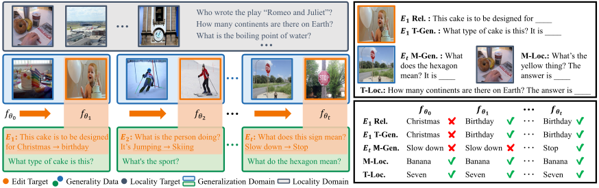
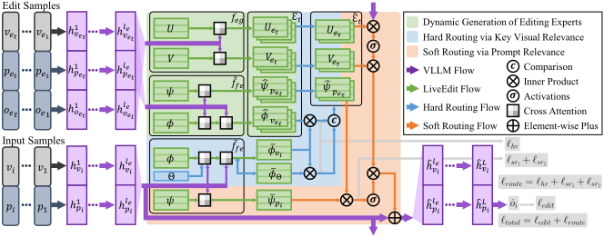

# LiveEdit

Source code for CVPR paper [Lifelong Knowledge Editing for Vision Language Models with Low-Rank Mixture-of-Experts](https://arxiv.org/abs/2411.15432)



**Figure 1**: Lifelong VLLM Editing. In this scenario, the edited VLLM is required to correctly respond to queries involving the edited data within the generalization domain, while maintaining consistent responses in locality domains. The top left shows test cases where Rel., T-Gen./M-Gen., T-Loc., and M-Loc. denote reliability, text/modal generality, and text locality, respectively. The bottom right illustrates the responses of an effectively edited VLLM across several editing timesteps.



**Figure 2**: Illustration of the LiveEdit framework. The upper part illustrates the editing process of LiveEdit. At time step $t$, the representation of an edit sample $(v_{e_t},p_{e_t},o_{e_t})$ at layer $l_e$ serves as an editing signal to generate the editing expert $(U_{e_t}, V_{e_t})$ via $f_{eg}$ and routing features $(\hat{\phi}_{v_{e_t}},\hat{\psi}_{p_{e_t}})$ via $\hat{f}_{fe}$. Both are then added to the expert repository $\mathcal{E}_{t}$. The lower part shows the VLLM inference process with LiveEdit, where $\bar{f}_{fe}$ extracts input sample features at layer $l_e$ to route editing experts, which then adapt the representation.


# Setup
1. Please download the MMEdit datasets from the URL provided in [1] and place the related folders in the `data/easy-edit-mm` directory.
2. Please download the VLKEB dataset from the URL provided in [2] and place the related folders in the `data/VLKEB` directory.
3. Please modify the `ROOT_PATH` in `utils/GLOBAL.py` to the absolute path of the current directory, and update `model_path_map` to the absolute paths of each backbone's weights.

# Train editors
Please follow the script below to train an editor that requires training:

`python train_vllm_editor.py -en liveedit -mn blip2 -dna EVQA -bs 8 -dvc "cuda:0" -edvc 0 -lkpt None -tnp EVQA -eps 50 -sci 500`

# Evaluate editors
Please follow the script below to evaluate the editors. If an editor does not require training, please set `-ckpt` to `None`."

`python test_vllm_edit.py -en "liveedit" -mn "blip2" -sen 1000 -dvc "cuda:0" -dn "EVQA" -ckpt "records/liveedit/blip2-opt-2.7b/EVQA/checkpoints/ckpt"`


# Citation
Please cite our paper if you use LiveEdit in your work.
```bibtex
@article{DBLP:journals/corr/abs-2411-15432,
  author       = {Qizhou Chen and
                  Chengyu Wang and
                  Dakan Wang and
                  Taolin Zhang and
                  Wangyue Li and
                  Xiaofeng He},
  title        = {Lifelong Knowledge Editing for Vision Language Models with Low-Rank
                  Mixture-of-Experts},
  journal      = {CoRR},
  volume       = {abs/2411.15432},
  year         = {2024},
  url          = {https://doi.org/10.48550/arXiv.2411.15432},
  doi          = {10.48550/ARXIV.2411.15432},
  eprinttype    = {arXiv},
  eprint       = {2411.15432},
  timestamp    = {Wed, 01 Jan 2025 13:20:30 +0100},
  biburl       = {https://dblp.org/rec/journals/corr/abs-2411-15432.bib},
  bibsource    = {dblp computer science bibliography, https://dblp.org}
}
```


# Reference
[1] Can We Edit Multimodal Large Language Models? EMNLP 2023

[2] VLKEB: A Large Vision-Language Model Knowledge Editing Benchmark. NeurIPS 2024, Datasets and Benchmarks Track
